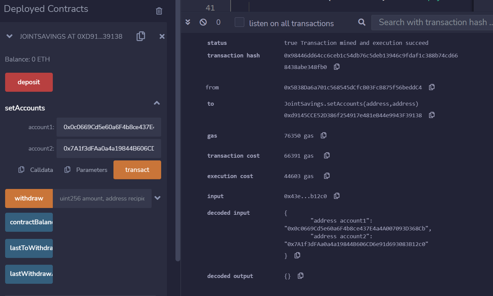
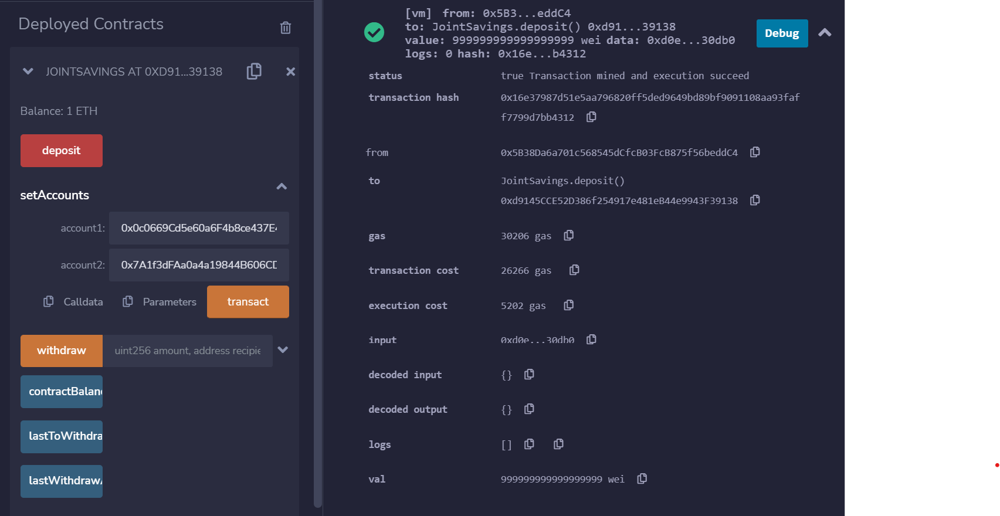
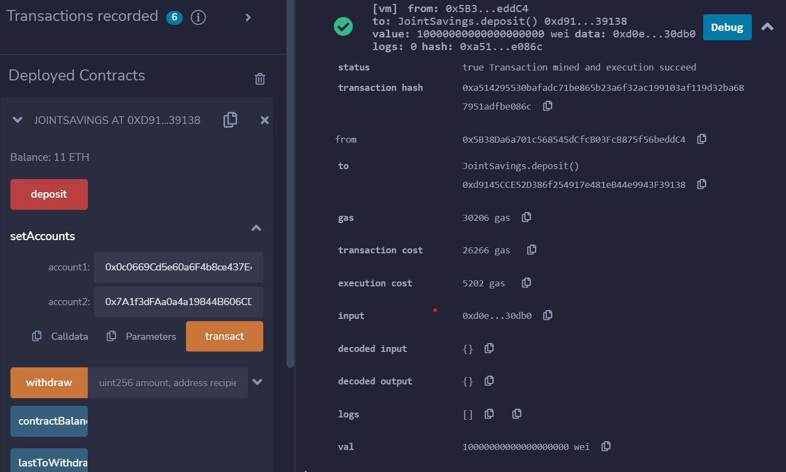
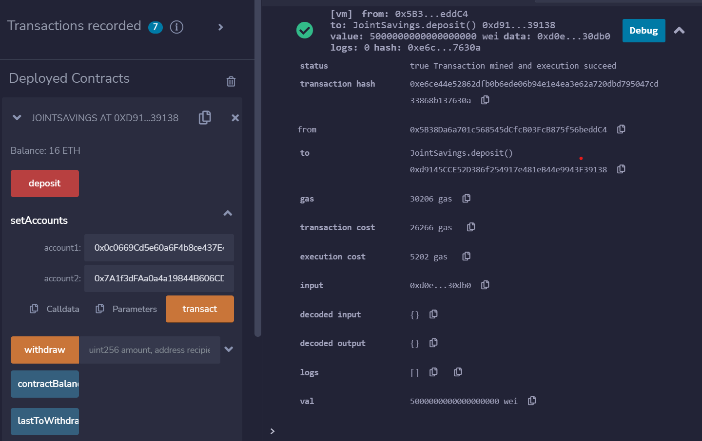
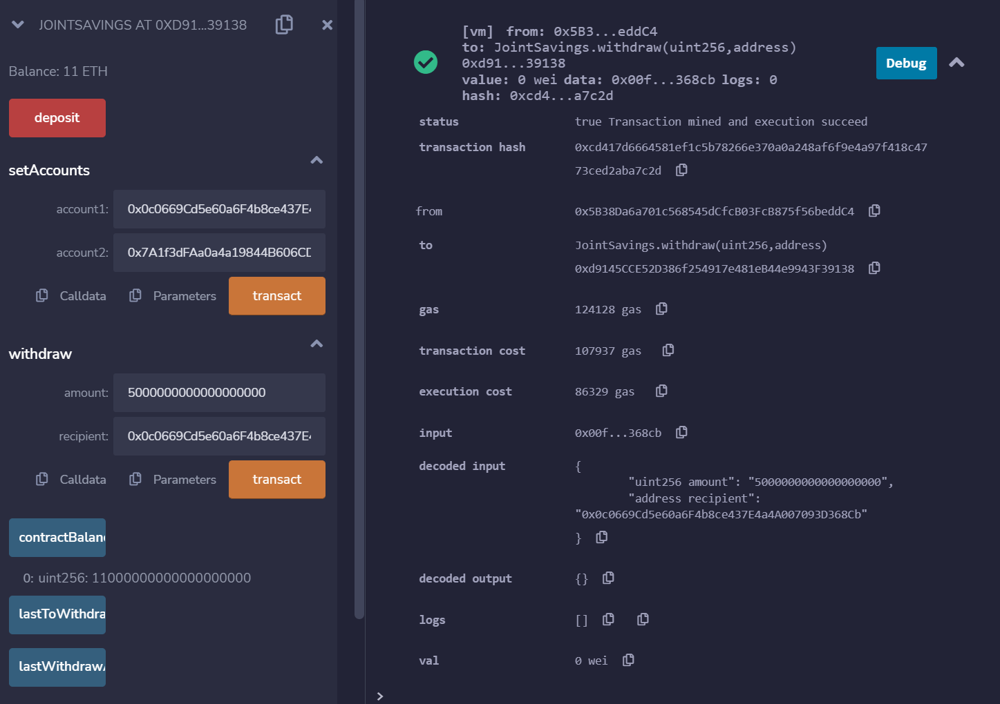
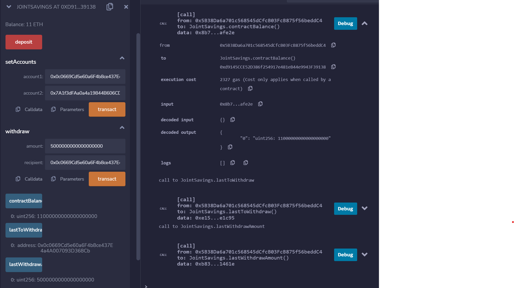
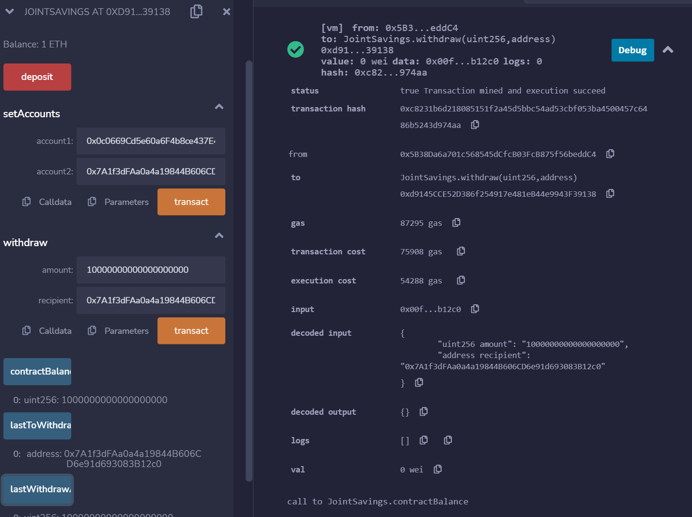

# Unit 20 - Smart Contracts "Joint Savings Account"

This project involved the creation of joint savings accounts, and the creation of a Solidity smart contract that accepts two user addresses. These addresses will be able to control a joint savings account. My smart contract will use ether management functions to implement a financial institution’s requirements for providing the features of the joint savings account. These features will consist of the ability to deposit and withdraw funds from the account.

## Interacting with the accounts

After compiling and deploying the smart contract I used the `setAccounts` feature to define the authorized Ethereum address that will be able to withdraw funds. 

I then tested the `deposit` function by sending three transactions and used `contractBalance` to verify the funds were added. The transactions were as follows:

1. Transaction 1: Send 1 ether as wei.

2. Transaction 2: Send 10 ether as wei.

3. Transaction 3: Send 5 ether.

After successfully depositing funds into my contract, I tested the contract’s withdrawal functionality with the following withdrawals: 

1. Withdrawal 1: Withdrawing 5 ether into `accountOne` 

After Withdrawal 1, I used the `contractBalance` function to verify that the funds were withdrawn. I also used the `lastToWithdraw` and `lastWithdrawAmount` functions to verify that the address and amount were correct

2. Withdrawal 2: Withdrawing 10 ether into `accountTwo`. 

After Withdrawal 2, I used the `contractBalance` function to verify that the funds were withdrawn. I also used the `lastToWithdraw` and `lastWithdrawAmount` functions to verify that the address and amount were correct

